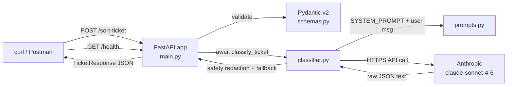

## Plan: QueueStorm Warmup Classifier Build

**TL;DR**
Execute `PLAN.md` prompts 1–6 in order inside a new `queueStorm-warmup/` subfolder at `e:\3-2\SUST Hackathon\`, then start uvicorn locally and run the 5-case curl test script to verify all grader cases. The API key is read from a shell-set `ANTHROPIC_API_KEY` env var; if it's set, a `.env` is generated for the local run (never committed). After local verification, run the safety checklist before declaring done.

**Steps**
1. Scaffold project: create `e:\3-2\SUST Hackathon\queueStorm-warmup\` with the file layout from `PLAN.md §2`. (depends on 0)
2. **PROMPT 1** — generate `schemas.py` (Pydantic v2 `TicketRequest` / `TicketResponse` with `Literal` enums and docstrings). (depends on 1)
3. **PROMPT 2** — generate `prompts.py` (`SYSTEM_PROMPT` constant with routing rules + 5 Bangladeshi MFS few-shot examples, ending with the "Return only the raw JSON object..." line). (depends on 1)
4. **PROMPT 3** — generate `classifier.py` (async `classify_ticket`, Anthropic SDK, safety redaction on `pin|otp|password|card number`, forced `human_review_required`, try/except fallback). (depends on 2, 3)
5. **PROMPT 4** — generate `main.py` (FastAPI app, `GET /health`, `POST /sort-ticket`, startup log, port from `${PORT:-8000}`). (depends on 2, 4)
6. Write `requirements.txt` (FastAPI, uvicorn[standard], pydantic≥2, anthropic, python-dotenv, httpx) and `.env.example` (`ANTHROPIC_API_KEY`, `PORT=8000`). (depends on 1)
7. If `ANTHROPIC_API_KEY` is set in the shell, write a non-committed `.env` from it; otherwise leave only `.env.example` in place. (depends on 6)
8. Write `.gitignore` (`.env`, `__pycache__`, `venv`, `*.pyc`, `.venv`). (depends on 1)
9. **PROMPT 5** — generate `README.md` (overview, stack, local setup incl. Windows venv, API reference with the 5 grader cases, Render deploy steps, env-var table, known limitations, grader test table). (depends on 5)
10. **PROMPT 6** — generate `Dockerfile` (`python:3.11-slim`, `/app`, `requirements.txt` first for layer cache, `EXPOSE 8000`, uvicorn CMD, no baked secrets) and `.dockerignore` (`.env`, `venv`, `__pycache__`, `.git`, `*.md` keep per need). (depends on 1)
11. Create + activate a local venv, `pip install -r requirements.txt`. (depends on 6)
12. Start `uvicorn main:app --host 127.0.0.1 --port 8000` in a background terminal. (depends on 11, 7 or skip-key path)
13. Run the 5-case curl test from `PLAN.md §7` plus `GET /health`; record pass/fail per case. (depends on 12)
14. Stop uvicorn. (depends on 13)
15. **Safety checklist** (`PLAN.md §6`): 10-point review (`.gitignore`, no hardcoded key, no `pin/otp/password/card number` in summaries, `human_review_required` forced, /health < 10s, /sort-ticket < 30s, ticket_id echo, confidence ∈ [0,1], HTTPS, README). (depends on 13)

**Relevant files**
- `e:\3-2\SUST Hackathon\queueStorm-warmup\schemas.py` — Pydantic v2 models (from PROMPT 1).
- `e:\3-2\SUST Hackathon\queueStorm-warmup\prompts.py` — `SYSTEM_PROMPT` with few-shot examples (PROMPT 2).
- `e:\3-2\SUST Hackathon\queueStorm-warmup\classifier.py` — async Anthropic call + safety redaction + fallback (PROMPT 3).
- `e:\3-2\SUST Hackathon\queueStorm-warmup\main.py` — FastAPI app, `/health`, `/sort-ticket` (PROMPT 4).
- `e:\3-2\SUST Hackathon\queueStorm-warmup\requirements.txt` — pinned deps from `PLAN.md §3`.
- `e:\3-2\SUST Hackathon\queueStorm-warmup\.env.example` — env template (`ANTHROPIC_API_KEY`, `PORT=8000`).
- `e:\3-2\SUST Hackathon\queueStorm-warmup\.env` — **only created** if shell has `ANTHROPIC_API_KEY`; gitignored.
- `e:\3-2\SUST Hackathon\queueStorm-warmup\.gitignore` — `.env`, `__pycache__`, `venv`.
- `e:\3-2\SUST Hackathon\queueStorm-warmup\README.md` — deploy runbook (PROMPT 5).
- `e:\3-2\SUST Hackathon\queueStorm-warmup\Dockerfile` + `.dockerignore` — container build (PROMPT 6).

**Diagrams**

Component / data flow (FastAPI service):


End-to-end request lifecycle for one ticket:
```mermaid
sequenceDiagram
    participant C as Client
    participant F as FastAPI main.py
    participant S as schemas.py
    participant Cl as classifier.py
    participant A as Anthropic API
    C->>F: POST /sort-ticket (TicketRequest)
    F->>S: validate body
    S-->>F: TicketRequest ok
    F->>Cl: await classify_ticket(ticket)
    Cl->>A: messages.create(system=SYSTEM_PROMPT, user msg, max_tokens=512)
    A-->>Cl: text (raw JSON)
    Cl->>Cl: strip fences, json.loads, redact pin/otp/password/card, force human_review
    Cl-->>F: TicketResponse
    F-->>C: 200 TicketResponse JSON
    Note over C,A: On any exception Cl returns fallback TicketResponse; F returns 500 only on truly unexpected errors
```

**Verification**
1. Static: each generated file matches its PROMPT block in `PLAN.md` (enums, docstrings, safety lines, fallback message, startup log, env-var handling).
2. Local server: `uvicorn main:app` starts; startup log "QueueStorm classifier is ready." appears.
3. `GET /health` returns `{"status":"ok","service":"queueStorm-classifier","version":"1.0.0"}` in < 10s.
4. `POST /sort-ticket` runs the 5 grader cases from `PLAN.md §7` and yields the expected routing per case (wrong_transfer→dispute_resolution/high, payment_failed→payments_ops/high, phishing→fraud_risk/critical + human_review_required=true, refund→customer_support/low or dispute_resolution/medium-high, app crash→other/customer_support/low).
5. Safety redaction: a crafted input whose LLM summary would contain "pin" / "otp" / "password" / "card number" is replaced with the neutral fallback sentence.
6. `human_review_required` is `true` for `severity==critical` and `case_type==phishing_or_social_engineering` regardless of LLM output.
7. Response `ticket_id` equals request `ticket_id`; `confidence` is a float in [0.0, 1.0].
8. `.gitignore` excludes `.env`; no Python file contains a hardcoded API key.
9. Latency: `/health` < 10s, `/sort-ticket` < 30s (LLM-bound).
10. README has the 8 sections from PROMPT 5; Dockerfile uses `python:3.11-slim`, copies `requirements.txt` first, exposes 8000, no baked secrets.
